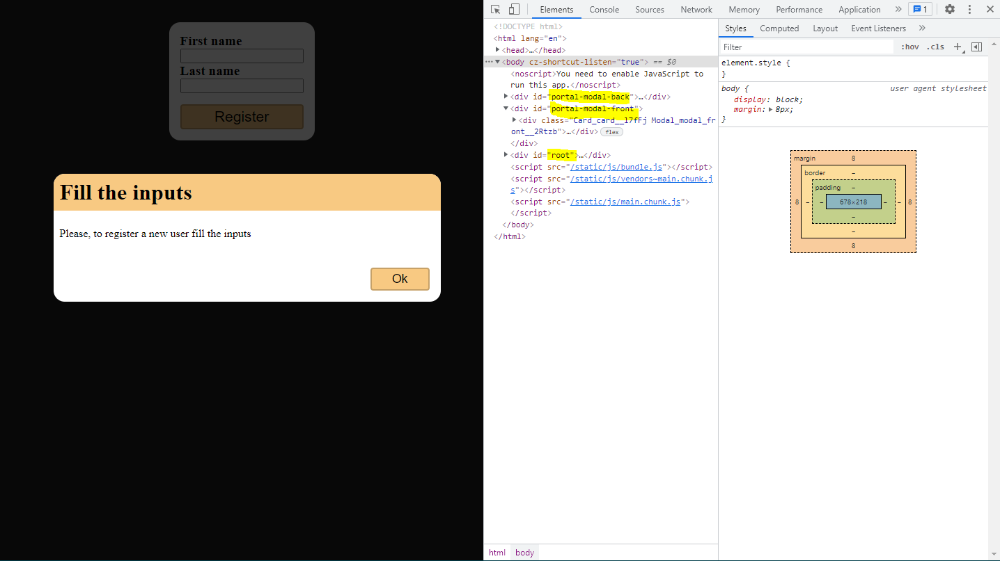

# React Portal Modal

My study about modals with React.createPortal method.
The idea is to create a component that has the same hierarchy to the root div on the index.html.

```
<div id="portal-modal-back"></div>
<div id="portal-modal-front"></div>
<div id="root"></div>
```



<div style="display: inline_block"><br>


</div>
<br><br>

[⬆ Voltar ao topo](#cs50-project-1)<br>
